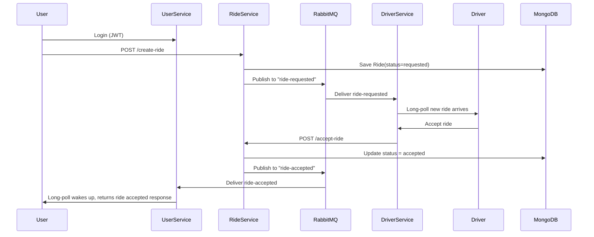

# 🚕 Cab Booking Microservices — README (Final Version)

A fully event-driven, microservice-based cab booking system built using:

**Node.js • Express • MongoDB • RabbitMQ • JWT • Long Polling • Event-Driven Architecture**

This system models a real-world flow similar to Ola/Uber where:

- Users register, login, request rides
- Drivers register, toggle availability, accept rides
- Ride service coordinates the entire flow
- RabbitMQ is used for inter-service communication
- Long-polling keeps users and drivers updated in real-time

You now have a **production-style architecture**, where each microservice runs independently and communicates asynchronously.

---

# 🏗️ Architecture Overview

Three microservices:

### 1. **User Service**

Handles user registration, login, and real-time ride acceptance notifications.
**Runs at:** `http://localhost:3001`

### 2. **Ride Service**

Creates rides, updates ride statuses, and publishes ride events.
**Runs at:** `http://localhost:3002`

### 3. **Driver Service**

Manages drivers, availability toggling, and receiving ride requests.
**Runs at:** `http://localhost:3003`

### RabbitMQ Queues

- **ride-requested** → informs drivers a new ride is created
- **ride-accepted** → informs users their ride is accepted

---

# 🧩 Architecture Diagram (UML)

```mermaid
flowchart LR

subgraph UserService[User Service]
U1[POST /register]
U2[POST /login]
U3[GET /accepted-ride<br/>(Long Polling)]
end

subgraph DriverService[Driver Service]
D1[POST /register]
D2[POST /login]
D3[PATCH /toggle-availability]
D4[GET /new-ride<br/>(Long Polling)]
D5[POST /accept-ride]
end

subgraph RideService[Ride Service]
R1[POST /create-ride]
R2[POST /accept-ride]
end

subgraph RabbitMQ[RabbitMQ Broker]
Q1[(ride-requested)]
Q2[(ride-accepted)]
end

U3 <-- Q2 --> RideService
RideService --> Q1 --> D4
U1 --> UserService
U2 --> UserService
D1 --> DriverService
D2 --> DriverService
D3 --> DriverService
R1 --> RideService
R2 --> RideService
```

---

# 🔄 Sequence Diagram: Ride Request → Driver Accepts → User Notified



---

# 🧱 Technologies Used

### Backend & APIs

- Node.js
- Express.js
- MongoDB + Mongoose
- JWT Authentication
- bcrypt for hashing

### Messaging & Architecture

- RabbitMQ (amqplib)
- Microservices Architecture
- Event-Driven Communication
- In-memory EventEmitters
- Long Polling for real-time effects

### Dev Tools

- Nodemon
- dotenv
- Postman

---

# 🔌 Service-to-Service Communication

### HTTP is used for:

- Auth (register/login)
- Creating rides
- Accepting rides
- Toggling driver availability

### RabbitMQ is used for:

- **ride-requested** → Driver service
- **ride-accepted** → User service

RabbitMQ ensures:

- durability
- message ordering
- fault tolerance
- decoupled services

---

# 🧪 API Endpoints (Complete Flow)

## USER SERVICE — `http://localhost:3001/cab/user`

### Register

**POST** `/register`
Body:

```json
{
  "name": "raj111",
  "email": "raj111",
  "password": "raj111"
}
```

### Login

**POST** `/login`

### Wait for ride accepted (Long Polling)

**GET** `/accepted-ride`
Header: Authorization: Bearer <token>

---

## DRIVER SERVICE — `http://localhost:3003/cab/driver`

### Register

**POST** `/register`

### Login

**POST** `/login`

### Toggle Availability

**PATCH** `/toggle-availability`

### Long Poll New Ride

**GET** `/new-ride`

---

## RIDE SERVICE — `http://localhost:3002/cab/ride`

### Create Ride

**POST** `/create-ride`
Header: user JWT

Body:

```json
{
  "pickupLocation": "Bihta21",
  "destination": "Air Port21"
}
```

### Accept Ride (Driver)

**POST** `/accept-ride`
Header: driver JWT

Body:

```json
{
  "rideId": "6919999bfa78f061612051d6"
}
```

---

# 🔁 Complete Data Flow Example

1. User registers → login → gets JWT
2. Driver registers → login → toggles availability
3. Driver opens `/new-ride` long poll
4. User creates ride
5. Ride service publishes **ride-requested** event
6. Driver service wakes up (long-poll) with ride
7. Driver accepts ride
8. Ride service updates DB + publishes **ride-accepted** event
9. User service wakes user long-poll with accepted ride

---

# 🎯 Summary

This microservice system includes:

- Fully independent services
- JWT auth across services
- Pub/Sub event model
- Long polling for near real-time updates
- RabbitMQ for reliable inter-service messaging
- Clean end-to-end ride lifecycle
